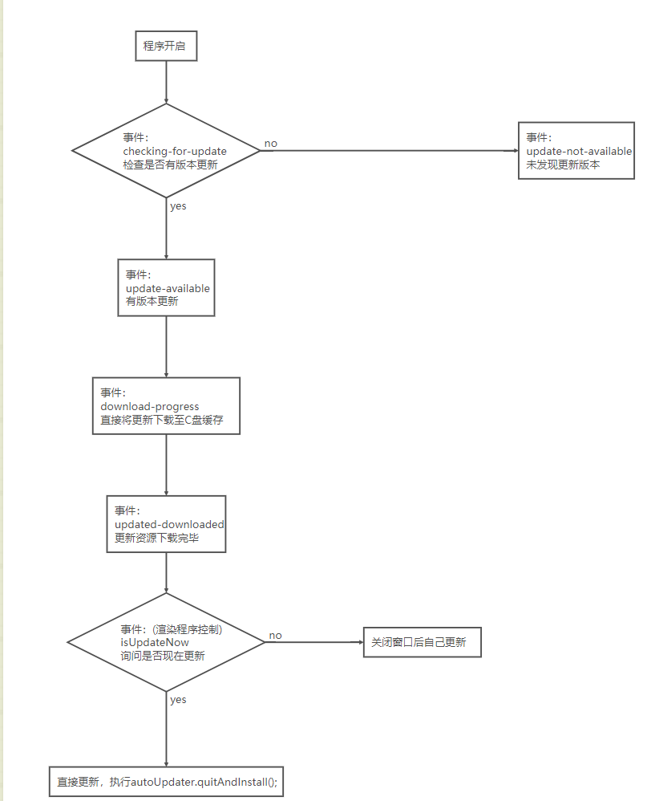

# electron builder
## 一键构建所有平台安装包
```shell
builder -mwl
electron-builder -mwl
electron-builder --all
```
## 一键构建所有mac安装包
```shell
builder -m
builder -o
builder --mac 
builder --macos
electron-builder -m
electron-builder -o
electron-builder --mac
electron-builder --macos
--------------------

builder --mac --x64[--ia32][--armv7l] //不加参数会默认当前系统架构
```

## 一件构建windows安装包
```shell
builder -w
builder --win
builder --windows

electron-builder -w --ia32["ia32", "x64", "armv7l", "arm64", "all"]
electron-builder --win
electron-builder --windows
```
## 一键构建linux安装包
```shell
builder -l
builder --linux
electron-builder -l
electron-builder --linux
```
## package.json
```json
{
  "name": "demo",
  "version": "0.0.2",
  "author": "四月 <507811581@qq.com>",
  "build": {  // electron-builder配置
    "productName":"xxxx",//项目名 这也是生成的exe文件的前缀名
    "appId": "xxxxx",//包名  
    "copyright":"xxxx",//版权  信息
    "compression": "store", // "store" | "normal"| "maximum" 打包压缩情况(store 相对较快)，store 39749kb, maximum 39186kb
    "directories": {
        "output": "build", // 输出文件夹
        "buildResources": "assets"
    }, 
    "asar": false, // asar打包
    "extraResources":  { // 拷贝dll等静态文件到指定位置
        "from": "./app-update.yml",
        "to": "./b.txt"
    },
    "files": [
      "dist/**/*",
      "./main.js",
      "./mainProcess",
      "!(./mainProcess/appWindow.js)"
    ],
    "win": {  
        "icon": "xxx/icon.ico",//图标路径,
        "extraResources":  { // 拷贝dll等静态文件到指定位置(用于某个系统配置)
            "from": "./app-update.yml",
            "to": "./b.txt"
        },
        "target":["msi","nsis"], //需要的目标安装包
        "artifactName": "${productName}-Web-Setup-${version}.${ext}",
        "publisherName": "ysj"
    },
    "mac":{
        "icon":".icns",
        "category": "public.app-category.productivity",
        "artifactName": "${productName}-${version}-${arch}.${ext}",
    },
    "linux": {
      "icon": "./mainProcess/assets/images/orchid256x256.png",
      "target": "deb",
      "executableName": "orchid",
      "desktop": {
        "Name": "orchid",
        "Type": "Application",
        "Icon": "/opt/orchid/resources/app/mainProcess/assets/images/orchid256x256.png",
        "Categories": "Utility",
        "Terminal": false
      }
    },
    "nsis": { //nsis安装过程的配置
        "oneClick": false, // 一键安装
        "guid": "xxxx", //注册表名字，不推荐修改
        "perMachine": true, // 是否开启安装时权限限制（此电脑或当前用户）
        "allowElevation": true, // 允许请求提升。 如果为false，则用户必须使用提升的权限重新启动安装程序。
        "allowToChangeInstallationDirectory": true, // 允许修改安装目录
        "installerIcon": "./build/icons/aaa.ico", // 安装图标
        "uninstallerIcon": "./build/icons/bbb.ico", //卸载图标
        "installerHeaderIcon": "./build/icons/aaa.ico", // 安装时头部图标
        "createDesktopShortcut": true, // 创建桌面图标
        "createStartMenuShortcut": true, // 创建开始菜单图标
        "shortcutName": "xxxx", // 图标名称
        "include": "build/script/installer.nsh", // 包含的自定义nsis脚本 这个对于构建需求严格得安装过程相当有用。
        "script" : "build/script/installer.nsh" // NSIS脚本的路径，用于自定义安装程序。 默认为build / installer.nsi
        //在对个性化安装过程需求并不复杂，只是需要修改一下安装位置，卸载提示等等的简单操作建议使用include配置,如果你需要炫酷的安装过程，建议使用script进行完全自定义。
    },
    "msi": {
      "artifactName":"${productName}-${version}-${platform}-${arch}.${ext}", 
      "createDesktopShortcut":true, 
      "createStartMenuShortcut":true, 
      "menuCategory":"xxx", 
      "oneClick":false, 
      "perMachine":false, 
      "publish":"github", 
      "runAfterFinish":false, 
      "shortcutName":"xxx", 
      "upgradeCode":"???", 
      "warningsAsErrors":false
    },
    "dmg":{
        "background": "assets/appdmg.png",
        "icon": "assets/icon.icns",
        "iconSize": 100,
        "contents":[
            {

                "x":410,
                "y":150,
                "type":"link",
                "path":"/Applications"
            },
            {
                "x":130,
                "y":150,
                "type":"file"
            }
        ],
        "window": {
            "width": 500,
            "height": 500
        }
    },

    "publish":[
        {
            "provider":"generic" ["github"], //服务器提供商
            "url":"http://xxxx" //服务器地址
        }
    ],

  }
}
```

## example
```
electron-builder -mwl                        //为macOS，Windows和Linux构建（同时构建）
electron-builder --linux deb tar.xz          //为Linux构建deb和tar.xz
electron-builder -c.extraMetadata.foo=bar    //将package.js属性`foo`设置为`bar`
electron-builder --config.nsis.unicode=false //为NSIS配置unicode选项
```
## cli
```cli
electron-builder build                    //构建命名                      [default]
electron-builder install-app-deps         //下载app依赖
electron-builder node-gyp-rebuild         //重建自己的本机代码
electron-builder create-self-signed-cert  //为Windows应用程序创建自签名代码签名证书
electron-builder start                    //使用electronic-webpack在开发模式下运行应用程序(须臾electron-webpack模块支持)
```

# electron updater
```js
// 注意这个autoUpdater不是electron中的autoUpdater
import { autoUpdater } from 'electron-updater'
import config from '../renderer/config/index'
const uploadUrl = process.env.NODE_ENV === 'development' ? config.dev.env.UPLOAD_URL : config.build.env.UPLOAD_URL
// 检测更新，在你想要检查更新的时候执行，renderer事件触发后的操作自行编写
function updateHandle() {
  let message = {
    appName:'XXXX',
    error: {
      key:"0",//更新出错
      msg:"更新出错"
    },
    checking: {
      key:"1",//检查更新中
      msg:"检查更新中..."
    },
    updateAva: {
      key:"2",//更新可用
      msg:"有新版本可用"
    },
    updateNotAva: {
      key:"3",//已是最新版本
      msg:"已是最新版本"
    },
    updated:{
      key:"4",//安装包已下载完成
      msg:"安装包已下载完成"
    }
  }
  autoUpdater.setFeedURL(uploadUrl)
  autoUpdater.autoDownload = false // 取消自动下载更新 如果不设置的话 发现新版本会自动进行下载 体验很不好
  autoUpdater.on('error', function(error){
      sendUpdateMessage(message.error)
  })
  //当开始检查更新的时候触发
  autoUpdater.on('checking-for-update', function() {
      sendUpdateMessage(message.checking)
  })
  //当发现一个可用更新的时候触发，更新包下载会自动开始
  autoUpdater.on('update-available', function(info) {
      console.log(info.version)
      sendUpdateMessage(message.updateAva)
      return false
  })
  //开始下载
  ipcMain.on('begin-download',(event,arg) => {
    console.log('begin download')
    autoUpdater.downloadUpdate()
  })
  //当没有可用更新的时候触发
  autoUpdater.on('update-not-available', function(info) {
      sendUpdateMessage(message.updateNotAva)
  })
// 更新下载进度事件
  autoUpdater.on('download-progress', function(progressObj) {
        mainWindow.webContents.send('downloadProgress', progressObj)
    })
    /**
    *  event Event
    *  releaseNotes String - 新版本更新公告
    *  releaseName String - 新的版本号  在Windows中只有这个可用
    *  releaseDate Date - 新版本发布的日期
    *  updateURL String - 更新地址
    * */
    autoUpdater.on('update-downloaded', function (event, releaseNotes, releaseName, releaseDate, updateUrl, quitAndUpdate) {
      // 发送已存在安装包的信息
      mainWindow.webContents.send('downloaded', message.updated) 
      // 离开并安装
      ipcMain.on('bengin-install',()=>{
        autoUpdater.quitAndInstall()
      })
  })
  ipcMain.on("checkForUpdate",() =>{
      //执行自动更新检查
      autoUpdater.checkForUpdates()
  })
}
// 通过main进程发送事件给renderer进程，提示更新信息
function sendUpdateMessage(text) {
  mainWindow.webContents.send('update_msg', text) 
}
```
